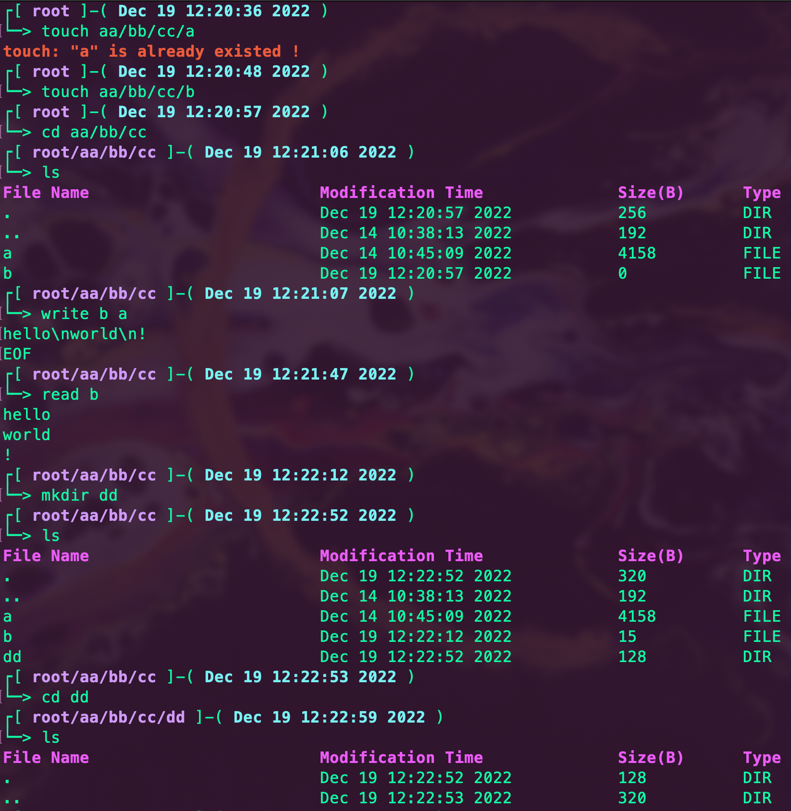
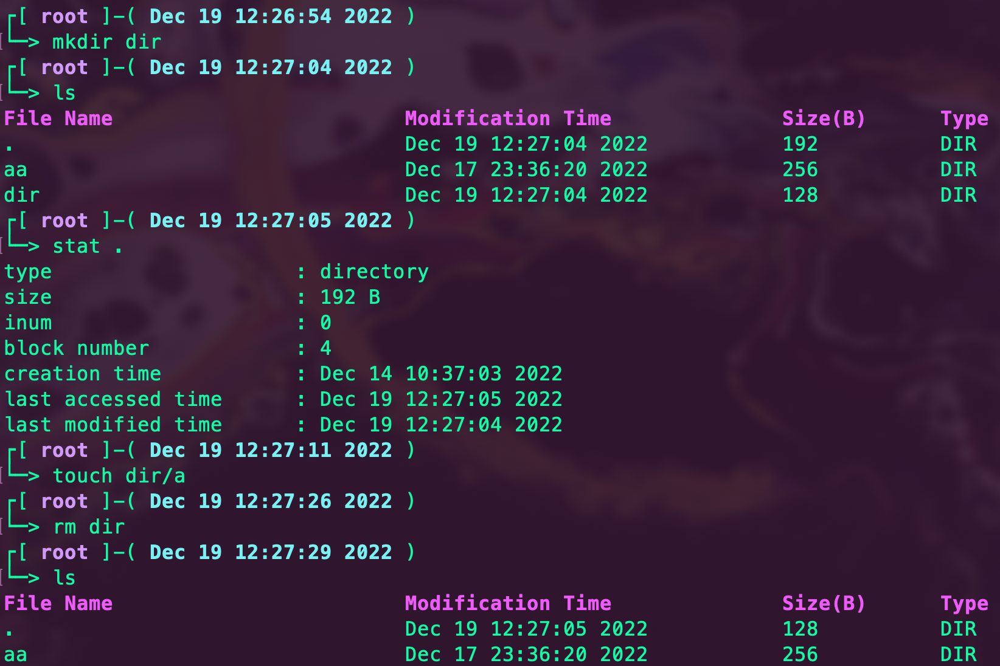

# README

## #TOC#
  - [整体概览](#整体概览)
  - [实现过程](#实现过程)
  - [效果展示](#效果展示)
  - [debug日志](#debug日志)
  - [食用方法](#食用方法)


## 整体概览

我实现了一个简易的索引式文件系统，用一个文件来模拟硬盘，通过对该文件的读写来模拟硬盘的读写。然而硬盘中存储的是01二进制数据，但文件中只能以字节为单位进行存储，因此为方便起见，我直接在文件中存储字符而非01，其中的1个字节就相当于磁盘上的8 bit。硬盘上的写入方式一般为覆盖式写入，相当于C语言中的`fopen(char *path,"r+")`，另外用`int fseek( FILE *stream, long offset, int origin )`函数来模拟硬盘寻址。

索引式文件系统的基本结构如下：

+ 超级块（super block）：文件系统的基本信息，总块数、inode个数等

+ inode位图（bitmap）：用二进制位标记已经使用的inode

+ data block位图：用二进制位标记已经使用的data block

+ inode block：存储所有文件（夹）的inode结构体，与inode位图的每一位一一对应

+ data blocks：存储文件的内容或文件夹下文件的索引信息

主要实现了以下操作和功能：

+ `cd ([path])`：更改当前工作目录至`path`，支持相对路径和绝对路径（下面所有`path`都支持相对路径），不提供`path`默认移动到根目录。

+ `ls ([directory path])`：显示指定文件夹下的文件名称、最后修改时间、字节、属性信息，默认显示当前文件夹。

+ `stat [file/directory path]`：显示指定文件（夹）的类型，（索引）大小，inum（inode编号），data block编号，创建时间，修改时间，访问时间。

+ `mv [file/directory] [new path]`：移动文件（夹）至新路径，支持文件移动前后的名称不同，可以用来重命名。当`path`指向已有文件夹时默认不改名移动到该文件夹下。

+ `rm [file/directory path]`：删除文件（夹），如果是文件夹则递归删除内部所有文件（夹），同`rm -r directory`。

+ `touch [new file path]`：新建一个路径为`path`的文件，`path`必须包含文件名，且目标上一级文件夹下不能有重名的文件（夹）。

+ `mkdir [new directory path]`：新建一个路径为`path`的文件夹，`path`必须包含文件夹名，且目标上一级文件夹下不能有重名的文件（夹）。

+ `format`：格式化硬盘，复位两块位图，用垃圾数据填充inode block和data block，因此所有存储数据都将丢失。

+ `read [file path] ([start byte]) ([length of read])`：读取文件内容，并输出读取内容，可以指定起始字节，以及读取长度，默认读取整个文件。

+ `write [file path] [mode] ([start byte])`：写入文件，支持以下三种写入模式：

   + 覆盖式插入（`i`）：需要指定起始写入位置，写入位置覆盖原有内容，其余位置保留原有内容

   + 追加（`a`）：从原有内容的最后位置开始写入

   + 重写（`c`）：擦除原有内容，从头写入

## 实现过程

1. 首先确定文件系统的基本参数，存储空间为64KB，block大小为4KB，因此共计16个block（超级块×1+inode位图×1+data block位图×1+inode block×1+data block×12），一个inode结构体大小为64KB：

   ```c
   typedef struct inode
   {
       char mode;                          //          1  B
       char ctime[TIME_LEN + 1];           //          10 B
       char atime[TIME_LEN + 1];           //          10 B
       char mtime[TIME_LEN + 1];           //          10 B
       int size;                           //          6  B
       int bnum;                           //          3  B
       int inum;                           //          3  B
       int block[IBLOCK_NUM];              // 3B * 7 = 21 B
   } inode;                                // TOTAL    64 B
   ```

   主要包含类型，修改、创建、访问时间，大小，data block块数，inum，data block编号，其中block包含6个直接块（direct block）和1个间接块（indirect block），间接块对应一个data block的编号，存储其余直接块的编号，可以认为是二级索引。

   另外每个文件夹的data block中存储所有子文件（夹）的条目信息，条目结构体item如下所示：

   ```c
   typedef struct item
   {
       int inum;                           //          3  B
       int strlen;                         //          4  B
       char name[FILENAME_MAX_LEN + 1];    //          57 B
   } item;                                 // TOTAL    64 B
   ```

   包含每个条目的inum、名称及名称长度。

2. 每个命令对应函数`cmd_CommandName`，参数个数是否与命令匹配主要由交互命令行负责，命令函数负责自身功能的实现以及错误参数的处理。每个命令都拥有一定的容错鲁棒性，不会轻易使系统崩溃。

3. `void initConsole()`：初始化交互界面。主交互界面采取命令行的形式，并显示当前工作目录的完整路径以及此刻的时间信息。读入一行，以空格串为分隔符提取所有参数，存入一个字符串数组，并统计参数个数，然后根据第一个参数（命令名称）调用相关函数。

4. `int path2inum(char *p)`：用一个全局字符串数组`path`存储当前工作路径上各级名称，由于数组大小需要提前指定，因此路径的级数上限是确定的，如果想要延长路径级数上限可以采取链表结构。若路径开头有【/】说明是绝对路径，从根目录开始搜索；反之则是相对路径，从当前工作目录开始搜索。另外设置一个级数变量`node`，表示当前工作目录所处的级数，根目录级数为1。该函数将路径字符串`p`转换为相应的inum并返回，如果失败则返回`FAIL`=-1。

5. `int newDataBlock()`：遍历data block位图，找到第一个未使用的data block索引，将其置1，并返回相应的块编号。

6. `char *formatTime(struct tm *pt, char *now)`：给定包含时间信息的结构体`pt`，该函数将其格式化为硬盘存储格式：

   $$
   2B\cdot year+1B\cdot month+2B\cdot day+5B\cdot second
   $$

   其中`year`是自2000年的2位十进制偏移量，`month`则是1位`'a'+Month-1`，`day`就是2位实际日期，`second`是将当天的时分秒转换为5位的秒数据。最后将格式化结果复制到`now`并返回`now`指针。获取当地时间的`tm`结构体主要通过`localtime`函数：

   ```c
       time_t t;
       time(&t);
       struct tm *pt = localtime(&t);
   ```

7. `int newInode(char mode, int finum)`：根据类型`mode`和父文件夹的inum建立一个新的inode，并写入基本信息。如果`mode`是文件夹则自动添加"."和".."两个子条目，同时在inode位图中标记相应位。最后返回新inode的inum。

8. `int nextBlock(inode *in, int i)`：给出文件（夹）的inode，返回第$(i+1)$个data block的编号，如果已经是最后一块则返回`FAIL`。

9. `void saveInode(inode *in)`：将`in`写入硬盘。

10. `void appendDataBlock(inode *in, char *s)`：将字符串s追加到`in`的data block内，同时包括必要时申请新的data block，建立二级索引，最后更新硬盘中的inode信息。该函数主要用来处理写入和增加文件夹内条目。

11. `void insertDataBlock(inode *in, char *s, int st)`：将字符串s覆盖式插入到`in`的data block中，并从第`st`个字节开始写入。如果`st>=in->size`就直接调用`appendDataBlock`，否则先写到当前data block的最后一个字节处，如果s还有剩余再调用`appendDataBlock`。该函数用来处理覆盖式写入命令。

12. `void loadInode(inode *in, int inum)`：根据inode的存储结构从硬盘中读出`inum`的inode到`in`所指向的结构体中。

13. `int addItem(int finum, int inum, char *name)`：在`finum`文件夹下添加名为`name`，inode编号`为inum`的item结构体。先构造存储字符串：
    
   $$
   3B\cdot inum+4B\cdot strlen+ (strlen) B\cdot name
   $$

   $\qquad$然后调用`appendDataBlock`写入data block。字符串可能不足64B，但`size+=64`。

14. `void loadItem(item *it, char *str)`：字符串`str`是item的存储字符串，根据每部分的固定长度将信息存入`it`指向的结构体中。

15. `int getInum(int finum, char *name)`：查找子文件（夹）的inum。`finum`必须是文件夹，遍历`finum`的data block找到名为`name`的item条目并返回inum。

16. `int rmItem(int finum, char *name)`：删除`finum`下名为`name`的item，并将后面的item都往前移动`ITEM_SIZE`B。如果最后一个data block为空就在位图的相应位上复0，并更新`inode`。最后返回删除inode的name。

17. `void delete(int inum)`：释放`inum`的inode和data block空间，本质上就只需将两个位图中的相应位复0即可，另外如果有二级索引页还需释放索引页的空间。如果`inum`是个文件夹，就递归释放空间。

18. `format`：首先通过`ftruncate(fileno(disk), 0)`清除硬盘，然后填充垃圾数据【#】，再重新建立根目录。（这个文件系统没有维护super block）

19. `cd`：在搜索路径的过程中，逐一把路径上的文件夹名称写入`path`，并将`node+=1`；每次回退路径时只需`node-=1`即可。如果目标路径不是文件夹或者根本不存在，则提示错误。

20. `stat`：从硬盘中读出相应的inode，并格式化输出。

21. `touch`：找到新建文件的目标目录的inum，若`getInum`返回的不是`FAIL`说明已存在同名项目，不予新建；否则调用`addItem`。

22. `ls`：遍历data block，根据子文件的inum读出相应的inode，然后依次输出。

23. `mkdir`：获取父文件夹的inum，然后`addItem(finum, newInode(IS_DIRE, finum), name)`

24. `mv`：只需要改动相应item的位置即可，先在新路径`addItem`再在原路径`rmItem`。

25. `rm`：先在父文件夹中`rmItem`，然后调用`delete`。

26. `read`：只能读取文件，先将指针移动到起始位置，然后设置一个`rem`表示剩余读取长度，如果没有指定读取长度，默认为文件大小，再设置一个`bias`表示该block开始读的偏移字节，那么对于每个data block就读取`min(rem, BLOCK_SIZE-bias)`字节数据，直到`rem`为0停止。

27. `write`：追加式写入调用`appendDataBlock`；覆盖式写入调用`insertDataBlock`；重写则先`delete`文件再从头写入，注意`delete`函数会将inode的位图复位，因此需要重新置1。换行输入"EOF"终止写入。

## 效果展示





## debug日志

+ `saveInode`函数每次都将所有的`block`写入磁盘，结果一些未初始化未使用的block是很大的整数，超出了格式化位数（"%Ns"不能保证输出N个字符），导致后面读取不正常。解决方法：每次只写入有效的block编号。
+ 新建inode时需要先写入磁盘再`addItem`。
+ 删除条目时需要将后面的条目前移，不能单纯地把后面的内容往前移动`ITEM_SIZE`位，因为块之间并不是不连续的，需要考虑将某一块的第一个条目移到前一块的最后一个条目上。
+ 最后一个data block没有内容时，勿忘`bnum-=1`，同时将bitmap对应位置0。
+ block中存储的是硬盘块号，不是data block的索引；inum就是inode的索引。
+ 删除文件时需要跳过"."和".."以防出现无限递归。
+ 函数写入文件但最后没有fclose会导致最后一次写入没有保存。

## 食用方法
```shell
   mkdir build && cd build
   cmake .. && make
   ./FileSystem
```
因为时间有限，不足之处在所难免，如有bug或者想与我讨论欢迎issue。
